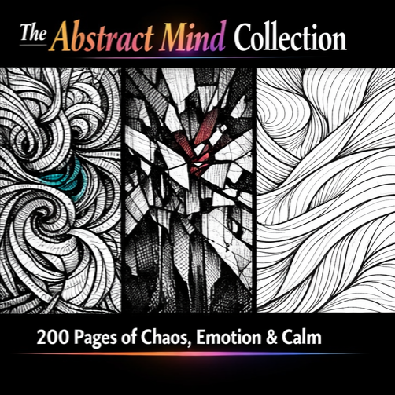

# Coloring Book Graphics Organization Guide

## ✅ COMPLETE STATUS

All graphics uploaded successfully! Here's how to organize them:

---

## 1. Chaos & Calm (50 Pages)

### For Website Display (bundle-chaos-calm.html):
- **Main hero image:** `AbstractEmporiumChaosNCalmcover.png`
- **Preview gallery:** Move to `preview-images/` folder:
  - `AbstractEmporiumChaosNCalmcover.png` (cover)
  - `AbstractEmporiumChaosNCalm1stpage.png` (first page)
  - `abstractemporiumchaosncalmcover13_135447.png` (cover variation)

### For PDF Creation:
1. **Cover page:** `AbstractEmporiumChaosNCalmcover.png`
2. **Page 1:** `AbstractEmporiumChaosNCalm1stpage.png`
3. **Pages 2-51:** All files from `ChaosNCalm50PagesAbstractColoringBook/` folder (50 .jpeg files)

**Total PDF:** 52 pages (cover + 1st page + 50 coloring pages)

---

## 2. Invisible Pain (50 Pages)

### For Website Display (bundle-invisible-pain.html):
- **Main hero image:** `abstractemporiuminvisiblepaincover.png`
- **Preview gallery:** Move to `preview-images/` folder:
  - `abstractemporiuminvisiblepaincover.png` (main cover)
  - `abstractemporiuminvisiblepain1stpage.png` (first page)
  - `AbstractemporiumInvisiblePaincover2.png` (cover variation)
  - `AbstractEmporiumInvisiblePain3.png` (extra preview)

### For PDF Creation:
1. **Cover page:** `abstractemporiuminvisiblepaincover.png`
2. **Page 1:** `abstractemporiuminvisiblepain1stpage.png`
3. **Pages 2-51:** All files from `InvisiblePain50PagesAbstractColoringBook/` folder

**Total PDF:** 52 pages

---

## 3. Healing Lines (50 Pages)

### For Website Display (bundle-healing-lines.html):
- **Main hero image:** `abstractemporiumhealinglinescover.png`
- **Preview gallery:** Move to `preview-images/` folder:
  - `abstractemporiumhealinglinescover.png` (cover)
  - `AbstractEmporiumHealingLines1stpage.png` (first page)
  - `AbstractEmporiumHealingLines.png` (extra preview)

### For PDF Creation:
1. **Cover page:** `abstractemporiumhealinglinescover.png`
2. **Page 1:** `AbstractEmporiumHealingLines1stpage.png`
3. **Pages 2-51:** All files from `HealingLines50PagesAbstractColoringBook/` folder

**Total PDF:** 52 pages

---

## 4. Abstract Mind Collection (200 Pages)

### For Website Display (bundle-abstract-mind.html):
- **Main hero image:** `abstractemporiumabtractmindcollectioncover.png`
- **Preview gallery:** Move to `preview-images/` folder:
  - `abstractemporiumabtractmindcollectioncover.png` (cover)
  - `abstractemporiumabstractmindcollection1stpage.png` (first page)
  - `AbstractEmporiumAbstractMindCollection.png` (preview 1)
  - `AbstractEmporiumAbstractMindCollection2.png` (preview 2)

### For PDF Creation:
1. **Cover page:** `abstractemporiumabtractmindcollectioncover.png`
2. **Page 1:** `abstractemporiumabstractmindcollection1stpage.png`
3. **Pages 2-201:** All files from `AbstractMindCollection200PagesAbstractColoringBook/` folder

**Total PDF:** 202 pages (cover + 1st page + 200 coloring pages)

---

## Next Steps for Launch:

### 1. Create PDFs
Use Adobe Acrobat or similar tool to combine:
- Cover PNG + 1st Page PNG + All coloring pages (in order)
- Export as single PDF at **300 DPI** for print quality
- Name files:
  - `Chaos-Calm-50-Pages-Abstract-Emporium.pdf`
  - `Invisible-Pain-50-Pages-Abstract-Emporium.pdf`
  - `Healing-Lines-50-Pages-Abstract-Emporium.pdf`
  - `Abstract-Mind-Collection-200-Pages-Abstract-Emporium.pdf`

### 2. Update Website Product Pages
Each HTML file needs image paths updated:

**bundle-chaos-calm.html:**
```html
<section class="bundle-hero">
    
</section>
```

**bundle-invisible-pain.html:**
```html
<section class="bundle-hero">
    
</section>
```

**bundle-healing-lines.html:**
```html
<section class="bundle-hero">
    
</section>
```

**bundle-abstract-mind.html:**
```html
<section class="bundle-hero">
    
</section>
```

### 3. Upload to Etsy/Gumroad
Once PDFs are created:
- Use cover PNGs as product listing images
- Use preview images (2-3 per product) to show inside pages
- Upload final PDFs as the digital download files
- Copy-paste product descriptions from `ETSY_GUMROAD_LISTINGS.md`

### 4. Set Up PayPal Buttons
- Log in to paypal.com/buttons
- Create button for each product:
  - Chaos & Calm: $7.99
  - Invisible Pain: $7.99
  - Healing Lines: $7.99
  - Abstract Mind Collection: $19.99
- Copy button HTML code into each product page

---

## Brand Consistency Check ✅

All 4 coloring book pages already have:
- ✅ Correct email: abstractemporiumart@outlook.com
- ✅ Complete social links (7 platforms)
- ✅ Consistent footer branding

No changes needed for brand consistency!

---

## File Organization Summary

**Keep in root folder:** Cover files for easy access
**Move to preview-images/:** 3-5 best preview images per product for website galleries
**Keep in subfolder:** All coloring page .jpeg files for PDF assembly

Your graphics are organized and ready for PDF creation! 🎨
